#End-to-End DevOps Automation Using Terraform, AWS, Docker, Jenkins & GitHub

# PROJECT GOAL
1.Create AWS infrastructure using Terraform
2.Deploy a Dockerized application
3.Automate deployment using Jenkins CI/CD
4.Use GitHub as source control
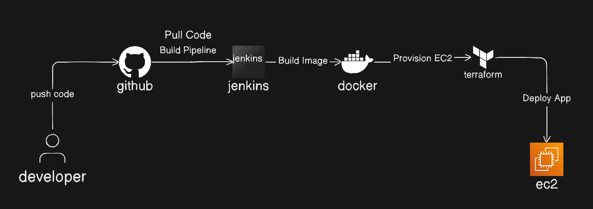

--------------------------------------------
# Inastall docker and git
`sudo apt update
`sudo apt install -y git docker.io`
___________________________________

## What is terrafrom ?
Terraform is a DevOps tool that allows you to create, manage, and update cloud infrastructure using code. Instead of manually setting up servers, databases, or networks, you define them in text files, and Terraform automatically provisions and manages them across multiple cloud providers, ensuring automation, consistency, and repeatability.

terafrom file extensio is "`.tf`"

#  Step 1: How to install terrafrom 

# [Terraform Installation Guide link](https://developer.hashicorp.com/terraform/downloads)

#1:Add HashiCorp GPG key
This ensures that the packages are trusted and verified.
	
`wget -O- https://apt.releases.hashicorp.com/gpg | sudo gpg --dearmor -o /usr/share/keyrings/hashicorp-archive-keyring.gpg`

#2:Add HashiCorp repository
`echo "deb [arch=$(dpkg --print-architecture) signed-by=/usr/share/keyrings/hashicorp-archive-keyring.gpg] https://apt.releases.hashicorp.com $(grep -oP '(?<=UBUNTU_CODENAME=).*' /etc/os-release || lsb_release -cs) main" | sudo tee /etc/apt/sources.list.d/hashicorp.list`

#3:Update and install Terraform
`sudo apt update && sudo apt install terraform`

`terraform version`
________________________________________________

# step 2: AWS SETUP
1.Create AWS Account

2.Create IAM User
Programmatic access(Access via AWS CLI, SDK, API)
AdministratorAccess
 
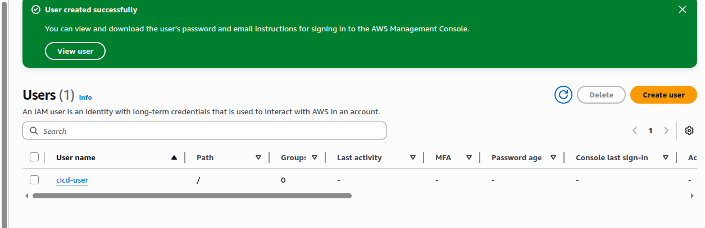

---> configure AWS CLI <---
 `aws configure`

__________________________________

# step 3: create  require files and dirs
1. `sudo mkdir devops-project`
2. `cd devops-project`

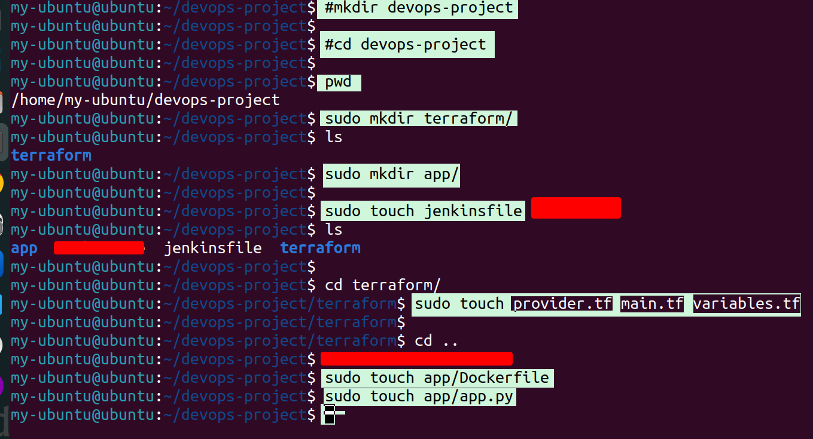

__________________________________

# Step 4: 
cofigure terrafrom files

--->
`sudo cd terraform`

--->
`sudo vim provider.tf`

``
provider "aws" {
  region = "us-east-1"
}

``
--->
`sudo vim variables.tf`

``
variable "instance_type" {
  default = "t3.micro"
}

``

`
variable "root_volume_size" {
  default = 20
}

`

--->
2.`sudo vim main.tf`

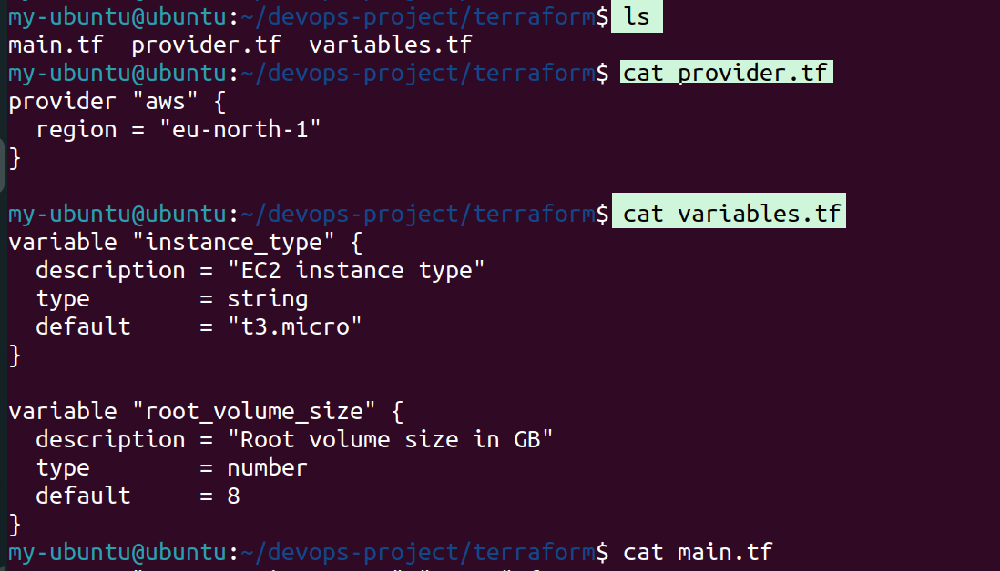

--->
`sudo vim main.tf`
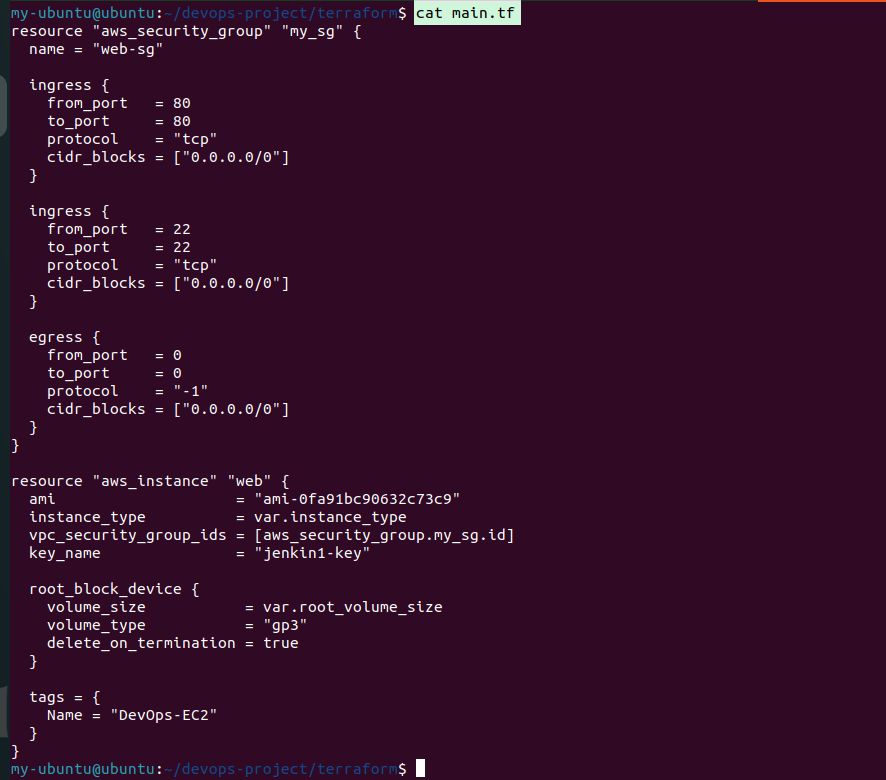

after creting this you need to run these commands 

# 1.`terraform init`
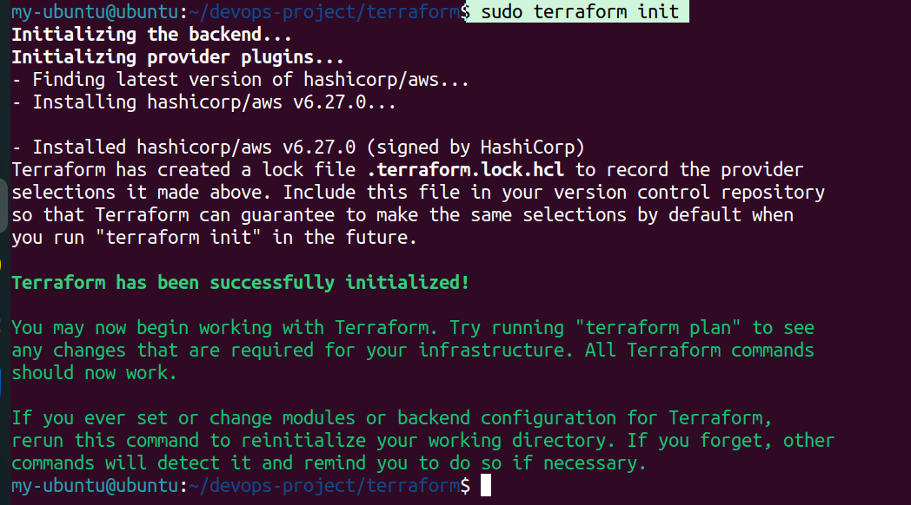

# 2.`terraform plan`
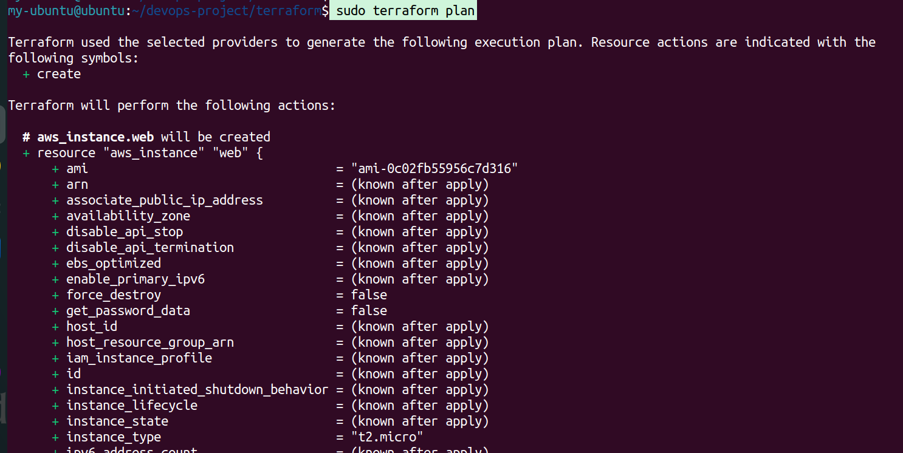

# 3.`terraform apply`
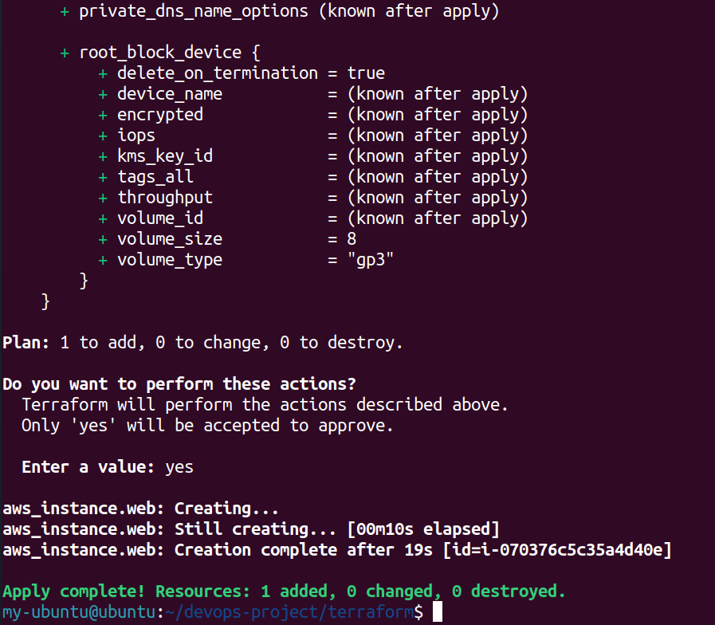
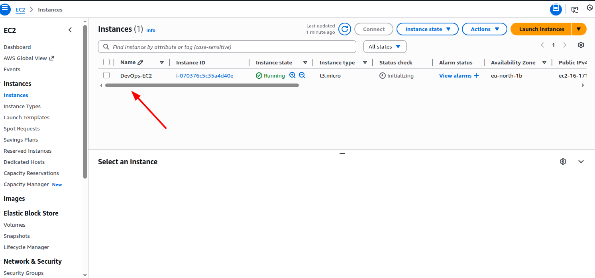

_____________________________

#  step 4: creat app.py file and Docker file

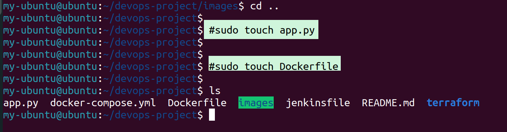
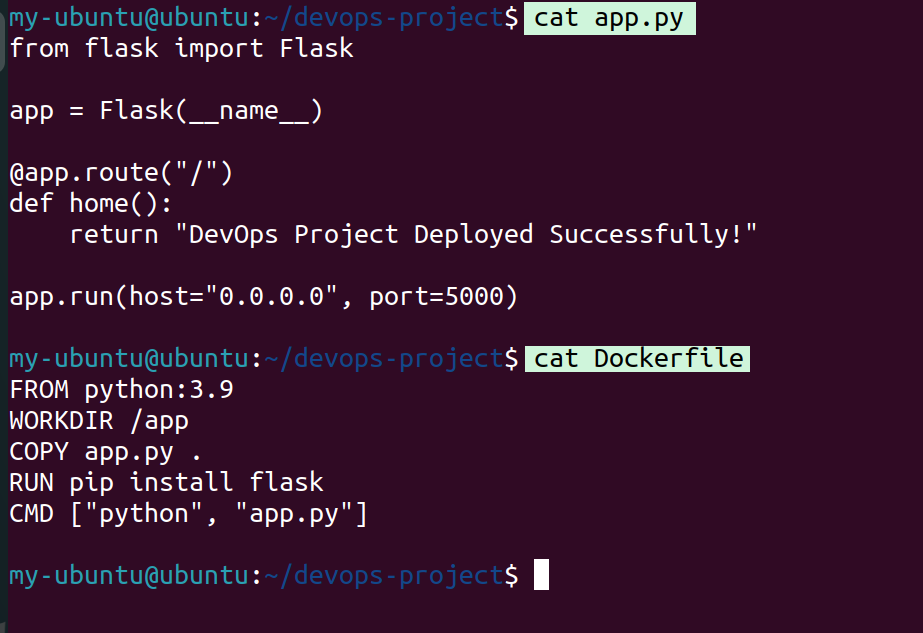
---->

``

from flask import Flask

app = Flask(__name__)

@app.route("/")
def home():
    return "DevOps Project Deployed Successfully!"

app.run(host="0.0.0.0", port=5000)

``

----->

`sudo vim Dockerfile'
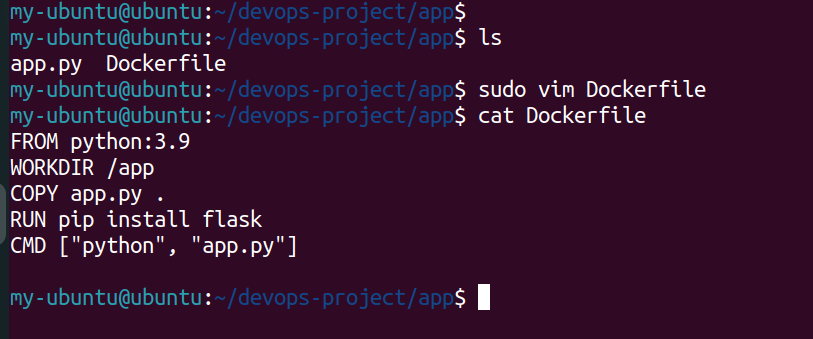
`
FROM python:3.9
WORKDIR /app
COPY app.py .
RUN pip install flask
CMD ["python", "app.py"]
`
##Test Docker Locally

1.`docker build -t devops-app .`

2.`docker run -d -p 5000:5000 devops-app`
#check from browser
http://localhost

_______________

# create docker-compose.yml file
cat docker-compose.yml 
`
services:
  flask-app:
    build: .
    container_name: flask_app
    ports:
      - "5000:5000"
    restart: always
`
_______________________________

1.`sudo cd ..`
2.`sudo git init`
3.`sudo git add .`
4.`sudo git commit -m "Initial DevOps project"`
5.`sudo git branch -M main`
6.`sudo git remote add origin https://github.com/hasinUllah565/devops-project.git`
7.`git remote -v`
8.`sudo git push -u origin main`
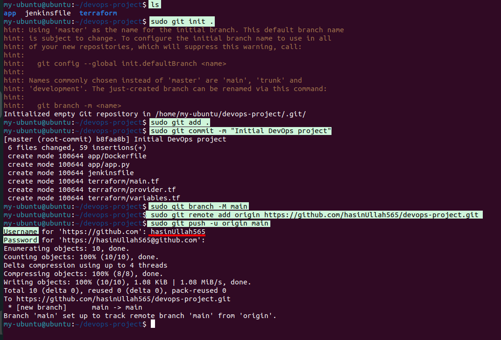

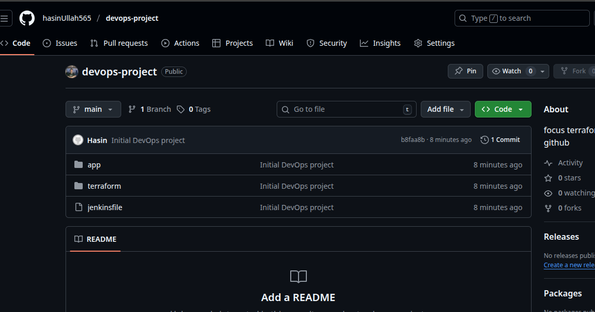
_________________________________

# STEP 5: JENKINS (CI/CD)
#connect your machine using ssh with your local

# `ssh -i "jenkin1-key.pem" ubuntu@ec2IP`
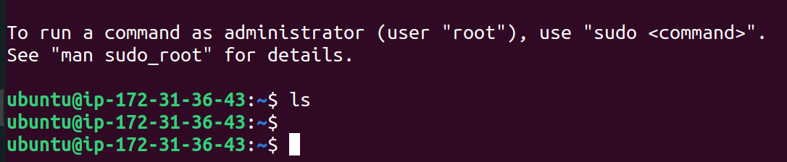

#  Install Jenkins on EC2 or local VM
# [Jenkins Installation Guide link](https://www.jenkins.io/doc/book/installing/linux/)

1.`sudo apt install -y openjdk-11-jdk`
2.`wget -q -O - https://pkg.jenkins.io/debian/jenkins.io.key | sudo tee /usr/share/keyrings/jenkins-keyring.asc > /dev/null
`
3.wget -q -O - https://pkg.jenkins.io/debian-stable/jenkins.io.key | sudo apt-key add -`
`sudo apt update`

4.`sudo apt install jenkins -y`

##http://EC2-IP:8080

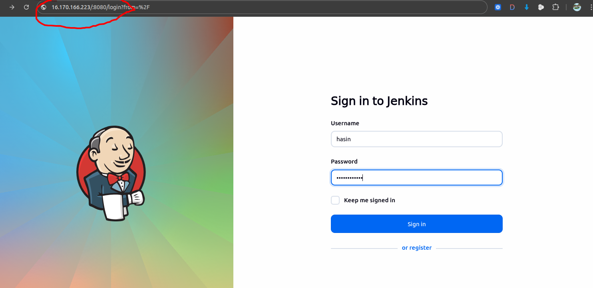

#  Jenkinsfile (PIPELINE)
# In this pipeline, we use variables for security purposes

Jenkins `Dashboard` → `Manage Jenkins` → `Credentials` → (choose domain) → `Add Credentials` → Select type (e.g., Username with password or Secret text) → Enter ID (e.g., `dockerhub`) → Enter `secret` → `Save`

# cat jenkinsfile 

``
pipeline {
    agent any

    stages {
        stage('Clone GitHub') {
            steps {
                git url:'https://github.com/hasinUllah565/devops-project.git' ,branch:"main"
            }
        }

        stage('Docker Login') {
            steps {
                withCredentials([usernamePassword(
                    credentialsId: 'dockerhub', 
                    usernameVariable: 'DOCKER_USER', 
                    passwordVariable: 'DOCKER_PASS')]) {
                    
                    sh 'echo $DOCKER_PASS | docker login -u $DOCKER_USER --password-stdin'
                }
            }
        }

        stage('Build Docker Image') {
            steps {
                sh 'docker build -t devops-app .'
            }
        }

        stage('Deploy App') {
            steps {
                sh 'docker-compose down -v'
                sh 'docker-compose up -d'
            }
        }

        stage('Push to Docker Hub') {
            steps {
                withCredentials([usernamePassword(
                    credentialsId: 'dockerhub', 
                    usernameVariable: 'DOCKER_USER', 
                    passwordVariable: 'DOCKER_PASS')]) {
                    
                    sh 'docker tag devops-app $DOCKER_USER/devops-app:latest'
                    sh 'docker push $DOCKER_USER/devops-app:latest'
                }
            }
        }
    }
}

``
#click on build to build your pipline 
#after buidling your pipline it  `clone github code`-->`docker login`-->`docker build`-->`deploy app`-->`push to docker hub`
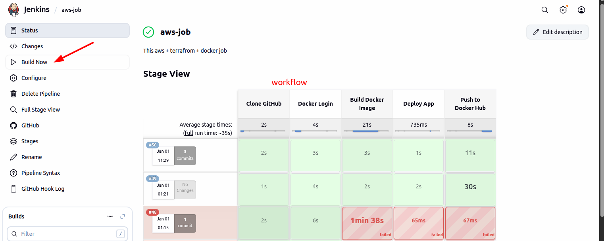

_________________________________

Terraform creates AWS EC2
Jenkins pulls code from GitHub
Docker builds app
App runs on EC2
Website accessible via EC2 Public IP

________________________________________

Resume:

End-to-End DevOps Automation Project
• Automated AWS infrastructure provisioning using Terraform (EC2, Security Groups)
• Containerized a Python application using Docker
• Designed CI/CD pipeline using Jenkins integrated with GitHub
• Deployed Dockerized application on AWS EC2
• Used Infrastructure as Code (IaC) for scalable and repeatable deployments

